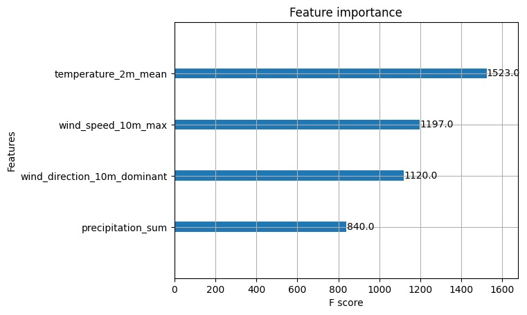
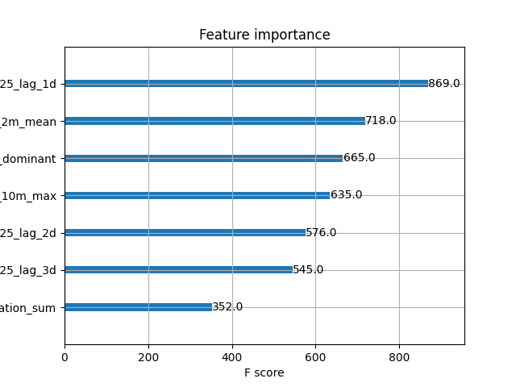
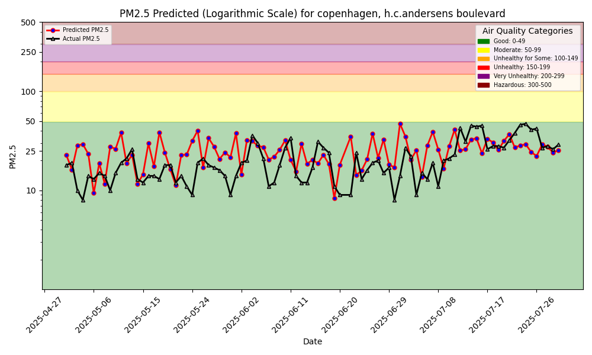

# Air Quality Prediction with Lagged Features

ID2223 Scalable Machine Learning Project - Group AA

## Overview

This project predicts PM2.5 air quality levels using weather data and historical pollution measurements. We built an ML system with Hopsworks Feature Store and analyzed how adding lagged features (previous 1-3 days of PM2.5 data) affects prediction accuracy.

**Sensor Location**: Copenhagen, Denmark (H.C. Andersens Boulevard)  
**Data Sources**: AQICN.org (air quality), OpenMeteo (weather)

## Research Question

How do lagged air quality features from previous days (1, 2, and 3 days ago) impact model performance?

## Methodology

We compared four models systematically:
- **Baseline**: Weather features only (temperature, precipitation, wind speed, wind direction)
- **+1,2,3 day lags**: Baseline + PM2.5 from past 3 days

## Results

| Model | MSE | R² | Improvement |
|-------|-----|----|-------------|
| Baseline (weather only) | 147.56 | -0.466 | - |
| + 1,2,3 day lags | **104.92** | **0.0201** | **+28.9%** |

### Key Findings

**Performance Impact**:
- Adding 3 lagged features improved MSE by 28.9% (147.56 → 104.92)
- R² improved from -0.466 to 0.0201, transforming the model from performing worse than a simple mean baseline to having predictive value
- The improvement shows that historical pollution data significantly enhances prediction accuracy

**Feature Importance**:
- Yesterday's PM2.5 (pm25_lag_1d) is the most important feature at 49.98%
- All 3 lagged features together account for 71.79% of model importance
- Weather features contribute 28.21%

**Why This Works**:

Air pollution doesn't change dramatically overnight. Yesterday's air quality is usually a good indicator of today's, because:
- Pollutants take time to disperse
- Emission sources (traffic, factories) follow consistent patterns
- Weather conditions change gradually
- Chemical reactions in the atmosphere are ongoing processes

The baseline model with only weather had negative R² because weather alone doesn't capture the persistence of pollution. Adding historical pollution data captures this temporal pattern and makes predictions much more accurate.

### Model Comparison Visualizations

#### Feature Importance Comparison

<table>
<tr>
<td width="50%">

**Baseline Model (Weather Only)**



</td>
<td width="50%">

**Enhanced Model (With Lagged Features)**



</td>
</tr>
</table>

#### PM2.5 Prediction Comparison

<table>
<tr>
<td width="50%">

**Baseline Model Predictions**



</td>
<td width="50%">

**Enhanced Model Predictions**


</td>
</tr>
</table>

The visualizations clearly show how adding lagged features transforms the model's predictive capability and shifts feature importance toward historical pollution data.

Detailed visualizations in `notebooks/airquality/6_lagged_features_analysis.ipynb`.

## System Architecture

The system follows a standard ML pipeline with a feature store:

```
AQICN API + OpenMeteo → Feature Pipeline → Hopsworks Feature Store → Training → Model Registry → Batch Inference
```

**Notebooks** (in `notebooks/airquality/`):
1. `1_air_quality_feature_backfill.ipynb` - Load historical data and create lagged features
2. `2_air_quality_feature_pipeline.ipynb` - Daily updates with new data
3. `3_air_quality_training_pipeline.ipynb` - Train XGBoost model
4. `4_air_quality_batch_inference.ipynb` - Generate predictions

    
## Setup

**Requirements**: Python 3.8+, Hopsworks account, AQICN API key

```bash
git clone https://github.com/Marcus-Shi/ID2223.git
cd ID2223
pip install -r requirements.txt
```

Create `.env` file with your API keys:
```
HOPSWORKS_API_KEY="your_key"
AQICN_API_KEY="your_key"
AQICN_URL="https://api.waqi.info/feed/@station_id/"
AQICN_CITY="Copenhagen"
AQICN_COUNTRY="Denmark"
AQICN_STREET="H.C. Andersens Boulevard"
```

**Run pipelines**:
```bash
make aq-backfill  # Initial setup
make aq-train     # Train model
make aq-inference # Make predictions
```

Or run notebooks in order from `notebooks/airquality/`.

## Technologies

- Hopsworks (Feature Store)
- XGBoost (Model)
- AQICN API (Air Quality Data)
- OpenMeteo API (Weather Data)

## Contributors

Xintong Mao & Chenyang Shi (Group AA)  
ID2223 Scalable Machine Learning, KTH  
November 2025
